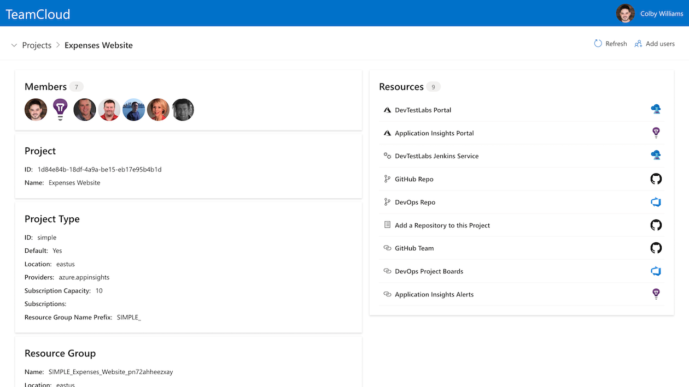
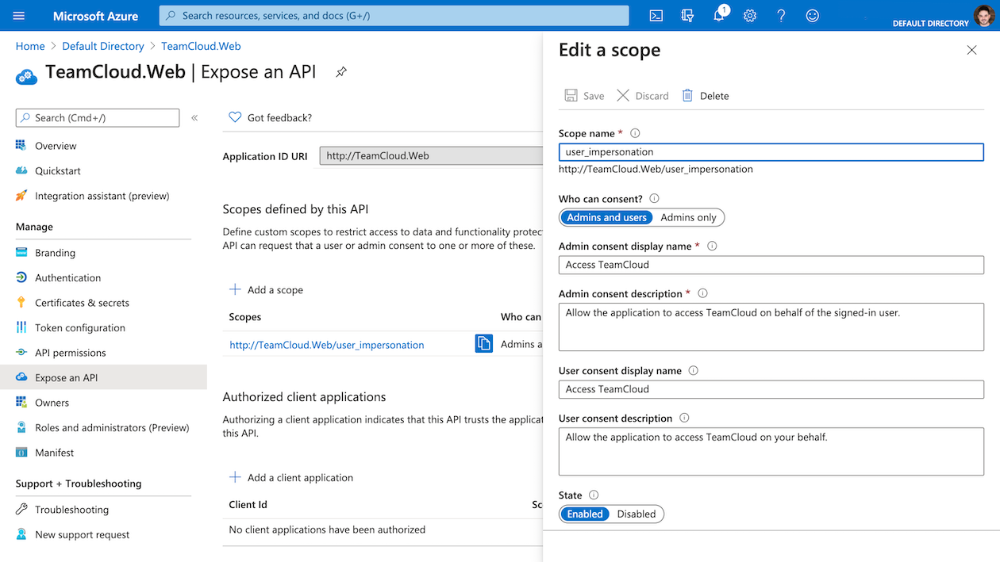

# TeamCloud Web Client

Although the [TeamCloud CLI](CLI.md) exposes all functionality provided by TeamCloud, you can also deploy a client website to interact with your instance.

## App registration

In order for the TeamCloud Web application to authenticate users and securely call the API, you must create a new app registration in Azure Active Directory:

#### Create an app registration

1. Sign in to the [Azure portal][azure-portal]. If your account has access to multiple tenants, select the **Directory + Subscription** filter in the top menu, and then select the tenant that should contain the app registration you're about to create.
2. Search for and select **Azure Active Directory**.
3. Under **Manage**, select **App registrations**.
4. Select **New registration** at the top:
   - For the application **Name**, enter **TeamCloud.Web**
   - Under **Supported account types** select **Accounts in this organizational directory only (Default Directory only - Single tenant)**.
   - Do **NOT** enter a **Redirect URI**.

5. Select **Register** to create the app registration.
6. Copy the **Application (client) ID** at the top of the page, as we'll need them later.

Next, configure the app registration with a Redirect URI (and scope) to specify where the Microsoft identity platform should redirect the client along with any security tokens.

#### Add a scope to the app registration

1. Under **Manage**, select **Expose an API**.
2. Select **Add a scope**.
3. For the **Application ID URI**, enter **http://TeamCloud.Web**
4. Select **Save and continue**, and fill in the form as follows:
   - **Scope name**: user_impersonation
   - **Who can consent?**: Admins and users
   - **Admin consent display name**: Access TeamCloud
   - **Admin consent description**: Allow the application to access TeamCloud on behalf of the signed-in user.
   - **User consent display name**: Access TeamCloud
   - **User consent description**: Allow the application to access TeamCloud on your behalf.
   - **State**: Enabled

5. Select **Add scope** to add the scope.

#### Add a platform to the app registration

1. Under **Manage**, select **Authentication**, and then select **Add a platform**.
2. Under **Web applications**, select **Single-page application** tile.
3. Under **Redirect URIs**, enter a [redirect URI][reply-url].
   **:bangbang: IMPORTANT :bangbang:**
   **Your redirect URI is the name (subdomain) of your TeamCloud instance with `-web` appended to the end.**
   **For example, if your TeamCloud instance is at `https://myteamcloud.azurewebsites.net`, your redirect URI will be `https://myteamcloud-web.azurewebsites.net`**
4. Leave **Logout URL** empty.
5. Under **Implicit grant**, make sure both **Access tokens** and **ID tokens** are **selected**.
6. Select **Configure** to finish adding the redirect URI.

[azure-portal]:https://portal.azure.com/
[reply-url]:https://docs.microsoft.com/en-us/azure/active-directory/develop/reply-url
